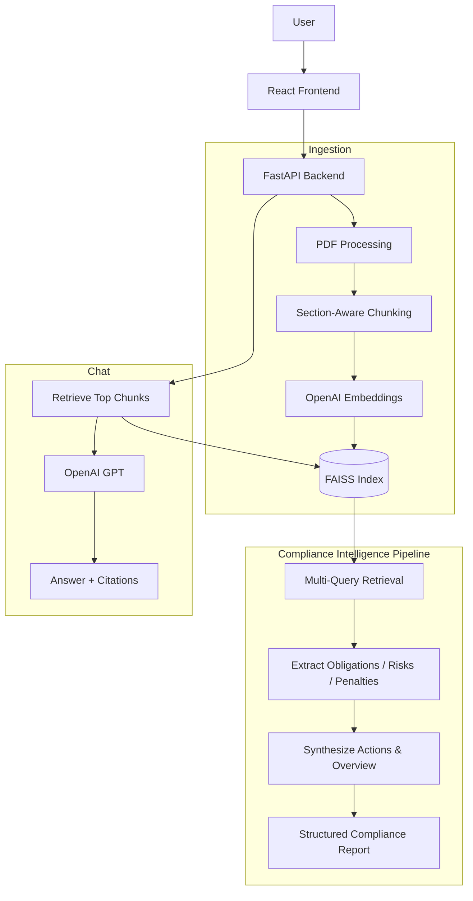

# Compliance Copilot

A full-stack compliance intelligence platform for uploading PDF documents, extracting structured compliance outcomes, and asking document-grounded questions with RAG.

## What It Does

Beyond document Q&A, Compliance Copilot translates retrieved content into **actionable compliance intelligence**:

- **Obligations** — mandatory requirements with priority, category, deadlines, and page citations
- **Risks** — non-compliance exposure with severity ratings and links to obligations
- **Penalties** — fines, sanctions, and enforcement actions where stated in the document
- **Recommended Actions** — concrete steps for compliance teams, linked to risks and obligations
- **Missing Information** — gaps and ambiguities that need clarification

## Architecture



### Compliance Intelligence Pipeline

1. **Multi-query retrieval** — runs targeted searches for obligations, penalties, risks, deadlines, controls, and scope
2. **Extraction pass** — LLM extracts structured obligations, risks, and penalties with source references
3. **Synthesis pass** — generates executive overview, risk level, gaps, and recommended actions linked to extracted facts
4. **Citation resolution** — maps REF labels back to page numbers and section headings

## Folder Structure

```text
compliance-copilot/
├── backend/
│   ├── app/
│   │   ├── api/              # HTTP routes
│   │   ├── services/         # Business logic + compliance intelligence
│   │   ├── rag/              # Chunking + vector store
│   │   ├── prompts/          # LLM prompt templates
│   │   ├── storage/          # Uploads, indexes, metadata
│   │   ├── config.py
│   │   ├── schemas.py
│   │   └── main.py
│   ├── requirements.txt
│   ├── Procfile
│   └── railway.toml
└── frontend/
    └── src/
        ├── api.ts
        └── App.tsx
```

## Technology Choices

| Layer | Choice | Why |
|-------|--------|-----|
| API | FastAPI | Typed APIs, validation, Swagger out of the box |
| LLM | OpenAI | Reliable chat + embeddings |
| Vector store | FAISS | Simple local retrieval without extra infra |
| PDF parsing | PyMuPDF | Fast, accurate text extraction |
| Frontend | React + Vite + Tailwind | Lightweight, fast dev experience |

## API Endpoints

| Method | Path | Description |
|--------|------|-------------|
| `GET` | `/health` | Health check |
| `POST` | `/api/upload` | Upload and index a PDF |
| `GET` | `/api/upload/documents` | List uploaded documents |
| `POST` | `/api/chat` | Ask a document question (RAG) |
| `POST` | `/api/summary` | Generate structured compliance intelligence |

### Summary Response Shape

```json
{
  "document_id": "...",
  "summary": {
    "overview": "Executive summary",
    "document_type": "Privacy Policy",
    "regulatory_framework": "GDPR",
    "risk_level": "high",
    "obligations": [{ "id": "OBL-1", "title": "...", "priority": "high", "sources": [...] }],
    "risks": [{ "id": "RSK-1", "severity": "high", "related_obligation_ids": ["OBL-1"], ... }],
    "penalties": [{ "id": "PEN-1", "amount_or_range": "$10,000 per violation", ... }],
    "recommended_actions": [{ "id": "ACT-1", "priority": "high", "effort": "medium", ... }],
    "missing_information": ["..."],
    "analysis_notes": "..."
  }
}
```

Interactive docs: `http://localhost:8000/docs`

## Setup

### Backend

```bash
cd backend
python -m venv venv
source venv/bin/activate
pip install -r requirements.txt
cp .env.example .env
# Add OPENAI_API_KEY to .env
uvicorn app.main:app --reload
```

### Frontend

```bash
cd frontend
npm install
npm run dev
```

Optional frontend env:

```bash
VITE_API_URL=http://localhost:8000
```

## Deployment (Railway)

1. Create a Railway service from the `backend/` directory.
2. Set environment variables from `.env.example`.
3. Set `ENVIRONMENT=production`.
4. Set `CORS_ORIGINS` to your frontend URL.
5. Railway uses `railway.toml` / `Procfile` to start:

```bash
uvicorn app.main:app --host 0.0.0.0 --port $PORT
```

Persistent storage note: Railway ephemeral disks will reset uploaded files unless you attach a volume or move storage to object storage.

## Tradeoffs

- **Local FAISS + filesystem storage** keeps the project simple but is not multi-instance friendly without shared storage.
- **Multi-pass LLM analysis** produces richer compliance outcomes but uses more tokens than a single-shot summary.
- **RAG-grounded extraction** improves citation accuracy but depends on retrieval quality for long or poorly structured documents.
- **Score-based retrieval filtering** reduces hallucinations but may miss valid answers if thresholds are too strict.

## Future Improvements

- Object storage (S3) for uploads and indexes
- Persistent metadata database with analysis history
- Auth and per-user document isolation
- Streaming chat responses
- Evaluation dataset for retrieval and extraction quality
- Background jobs for large PDF processing
- Cross-document obligation mapping and framework taxonomies
