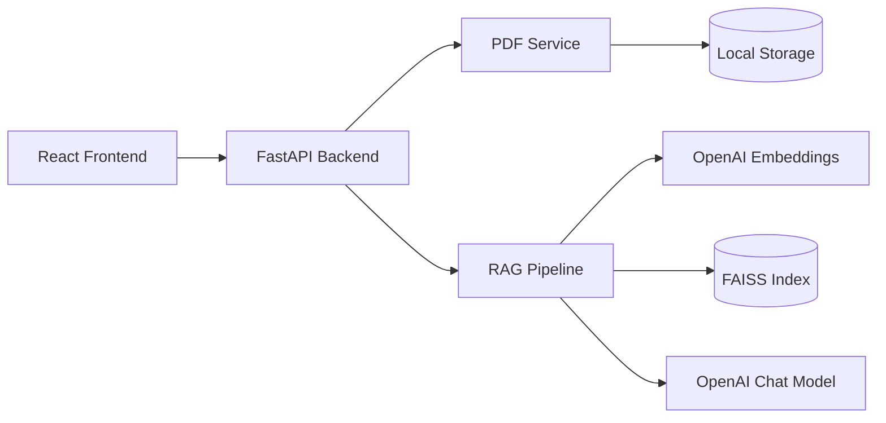

# Compliance Copilot

A full-stack compliance assistant for uploading PDF documents, generating structured compliance summaries, and asking document-grounded questions with RAG.

## Architecture



## Folder Structure

```text
compliance-copilot/
├── backend/
│   ├── app/
│   │   ├── api/              # HTTP routes
│   │   ├── services/         # Business logic
│   │   ├── rag/              # Chunking + vector store
│   │   ├── prompts/          # Prompt templates
│   │   ├── storage/          # Uploads, indexes, metadata
│   │   ├── config.py
│   │   ├── schemas.py
│   │   └── main.py
│   ├── requirements.txt
│   ├── Procfile
│   └── railway.toml
└── frontend/
    └── src/
        ├── api.ts
        └── App.tsx
```

## Technology Choices

| Layer | Choice | Why |
|-------|--------|-----|
| API | FastAPI | Typed APIs, validation, Swagger out of the box |
| LLM | OpenAI | Reliable chat + embeddings |
| Vector store | FAISS | Simple local retrieval without extra infra |
| PDF parsing | PyMuPDF | Fast, accurate text extraction |
| Frontend | React + Vite + Tailwind | Lightweight, fast dev experience |

## API Endpoints

| Method | Path | Description |
|--------|------|-------------|
| `GET` | `/health` | Health check |
| `POST` | `/api/upload` | Upload and index a PDF |
| `GET` | `/api/upload/documents` | List uploaded documents |
| `POST` | `/api/chat` | Ask a document question (RAG) |
| `POST` | `/api/summary` | Generate structured compliance summary |

Interactive docs: `http://localhost:8000/docs`

## Setup

### Backend

```bash
cd backend
python -m venv venv
source venv/bin/activate
pip install -r requirements.txt
cp .env.example .env
# Add OPENAI_API_KEY to .env
uvicorn app.main:app --reload
```

### Frontend

```bash
cd frontend
npm install
npm run dev
```

Optional frontend env:

```bash
VITE_API_URL=http://localhost:8000
```

## Deployment (Railway)

1. Create a Railway service from the `backend/` directory.
2. Set environment variables from `.env.example`.
3. Set `ENVIRONMENT=production`.
4. Set `CORS_ORIGINS` to your frontend URL.
5. Railway uses `railway.toml` / `Procfile` to start:

```bash
uvicorn app.main:app --host 0.0.0.0 --port $PORT
```

Persistent storage note: Railway ephemeral disks will reset uploaded files unless you attach a volume or move storage to object storage.

## Tradeoffs

- **Local FAISS + filesystem storage** keeps the project simple but is not multi-instance friendly without shared storage.
- **Score-based retrieval filtering** reduces hallucinations but may miss valid answers if thresholds are too strict.
- **Structured summary via JSON prompting** is lightweight but less strict than native structured output APIs.

## Future Improvements

- Object storage (S3) for uploads and indexes
- Persistent metadata database
- Auth and per-user document isolation
- Streaming chat responses
- Evaluation dataset for retrieval quality
- Background jobs for large PDF processing
